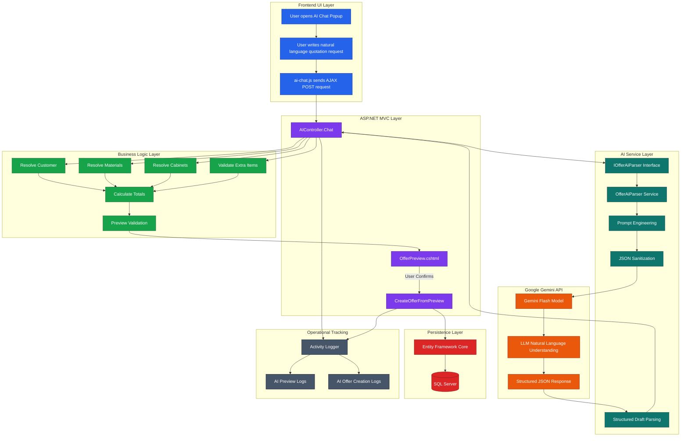
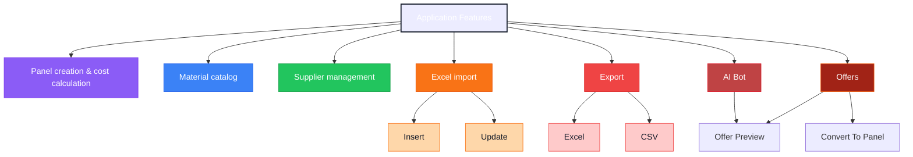
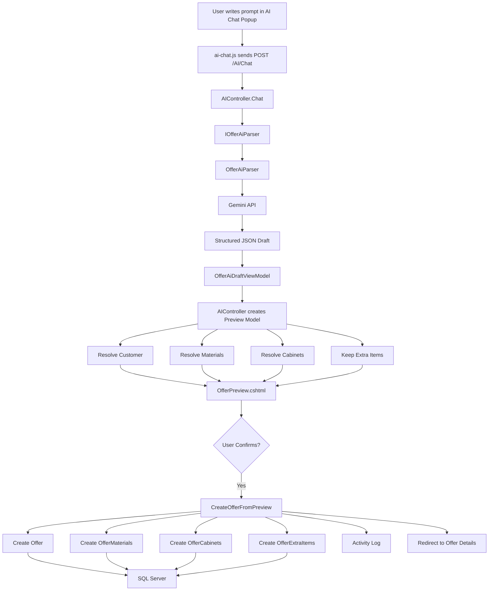
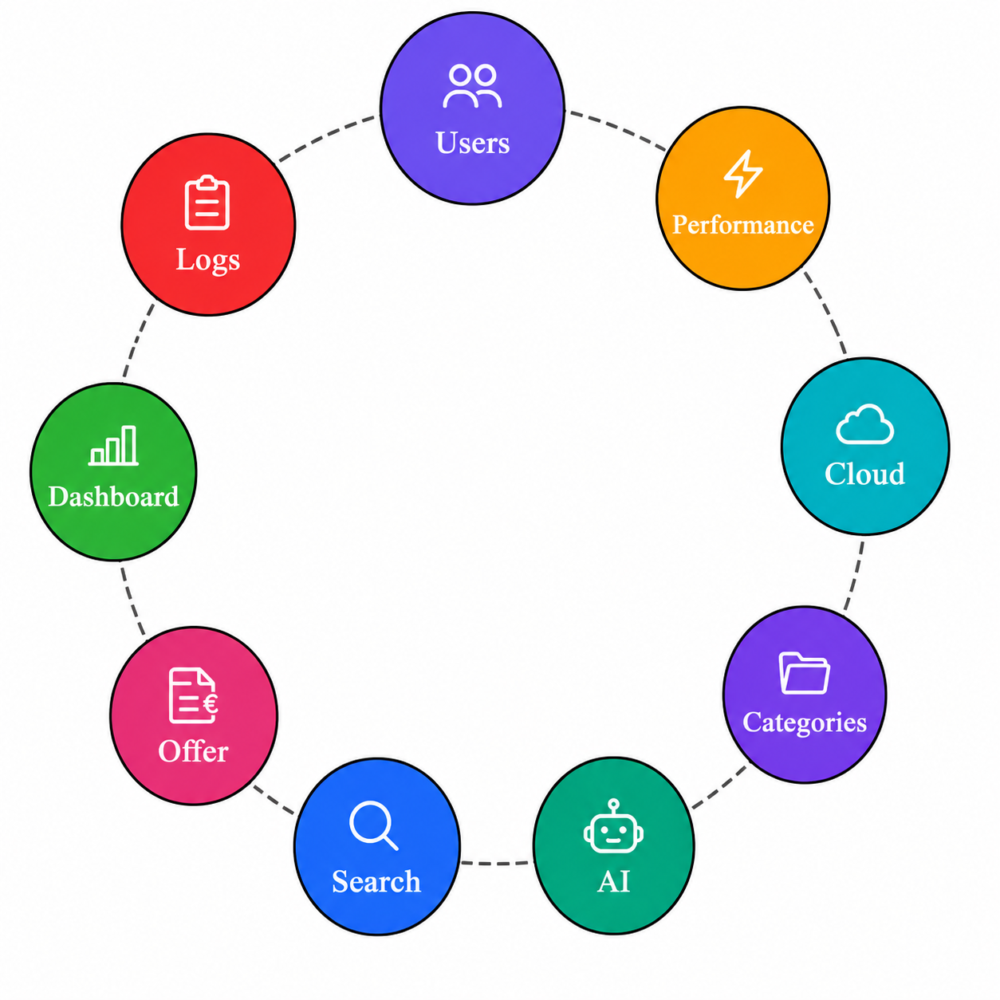

# ⚡ PanelApp


> Internal ERP-style platform for managing electrical distribution panel production, quotations, material pricing, supplier relationships and project costing.

----


# 📑 Table of Contents

* [General Information](#-general-information)
* [Current Capabilities](#-current-capabilities)
* [Technologies](#-technologies)
* [Architecture](#-architecture)
* [Folder Structure](#-folder-structure)
* [UI Preview](#-ui-preview)
* [Development Setup](#-development-setup
* [Database Setup](#-database-setup))
* [Features](#-features)
* [Code Highlights](#-code-highlights)
* [Excel Import](#-excel-import)
* [Authentication](#-authentication)
* [AI Assistant](#-ai-assistant)
* [Gemini Integration](#-gemini-integration)
* [Future Improvements](#-future-improvements)
* [Acknowledgements](#-acknowledgements)


----


# 📌 General Information

PanelApp is an ASP.NET Core MVC ERP-style platform designed for electrical distribution panel manufacturing workflows.

The platform focuses on:
- panel costing
- quotation management
- material catalog management
- supplier & customer organization
- AI-assisted quotation workflows
- Excel-based imports
- production workflow support
- operational tracking

----

# 🚀 Current Capabilities

✅ Panel management  
✅ Offer / quotation management  
✅ AI-powered quotation assistant  
✅ AI quotation preview workflow  
✅ Material catalog management  
✅ Supplier & customer management  
✅ Excel imports  
✅ Activity logging  
✅ Role-based authentication  
✅ Dark / Light mode  
✅ Snapshot pricing logic  
✅ Material auto-matching  
✅ Cabinet auto-matching  
✅ Extra item support  
✅ Labor & profit calculations  
✅ Responsive Bootstrap UI  

----

# 🧱 Technologies

- ASP.NET Core MVC (.NET 8)
- Entity Framework Core
- SQL Server
- Bootstrap 5
- Bootstrap Icons
- ClosedXML
- Session-based Authentication
- LINQ / EF Core Query Optimization
- Google Gemini API
- JSON-based AI parsing

# 🏗️ Architecture

```text
[ Browser UI ]
       |
       v
[ MVC Controllers ]
       |
       +-------------------+
       |                   |
       v                   v
[ AI Services ]     [ Business Logic ]
       |                   |
       +---------+---------+
                 |
                 v
      [ Entity Framework Core ]
                 |
                 v
           [ SQL Server ]
```


----


# 📁 Folder Structure


Detailed:
```text
ZL_panelapp/
│
├── Controllers/
│   ├── PanelsController.cs
│   ├── AiController.cs
│   ├── MaterialsController.cs
│   ├── HomeController.cs
│   ├── SuppliersController.cs
│   ├── ActivityLogsController.cs
│   ├── CustomersController.cs
│   ├── MaterialsController.cs
│   └── AccountController.cs
│
├── Models/
│   ├── Panel.cs
│   ├── PanelMaterial.cs
│   ├── PanelCabinet.cs
│   ├── PanelExtraItem.cs
│   ├── Offer.cs
│   ├── OfferMaterial.cs
│   ├── OfferCabinet.cs
│   ├── OfferExtraItem.cs
│   ├── Material.cs
│   ├── Supplier.cs
│   ├── ActivityLog.cs
│   ├── Customer.cs
│   ├── Cabinet.cs
│   ├── SupplierContactPerson.cs
│   └── User.cs
│
├── Views/
│   ├── AI/
│   ├── Panels/
│   ├── Offers/
│   ├── Materials/
│   ├── Suppliers/
│   ├── Home/
│   ├── ActivityLogs/
│   ├── Customers/
│   ├── Account/
│   └── Shared/
│       ├── _Layout.cshtml
│       └── _AuthLayout.cshtml
│
├── Data/
│   └── ApplicationDbContext.cs
│
├── ViewModels/
│   ├── AddMaterialToPanelViewModel.cs
│   ├── CopyPanelViewModel.cs
│   ├── CustomerIndexViewModel.cs
│   ├── EditPanelMaterialAdminViewModel.cs/
│	'
│	'
│	'
│   └── SupplierIndexViewModel.cs
│
└── wwwroot/
    └── css / js / images
```

----


# 🖼️ UI Preview

👉 Replace with real screenshots for production

## Login


## Dashboard


## Materials


## Panels


----

# 🛠️ Development Setup Guide

## Prerequisites

* Visual Studio 2022+
* .NET SDK 8
* SQL Server / SQL Express
* Git

### Verify

```bash
dotnet --version
sqlcmd -?
```

----

## Clone


```bash
git clone <repo>
cd panelapp
```

----

## Run

```bash
dotnet run
```

----

# 🗄️ Database Setup

For the purpose of our implementation we developed our database in [SQL Server 2022](https://www.microsoft.com/en-us/sql-server/sql-server-downloads)
## Install SQL Express

### On windows

Steps:

1. Download:
SQL Server (Express or Developer)
SSMS (management tool)
2. Run the installer → select:
    - Basic (quick)
    - Custom (recommended)
3. In the setup:

    Instance:
   - MSSQLSERVER (default)
   - Authentication:
  -- Windows + SQL Server (Mixed Mode)

    Set a password for sa

4. Install:
5. Open SSMS and connect:
```
 Server: localhost
 Auth: Windows Authentication
```
----

### Powershell
```
// Installer
Invoke-WebRequest -Uri https://go.microsoft.com/fwlink/?linkid=866662 -OutFile SQLServer.exe

// Silent install
Start-Process -Wait -FilePath .\SQLServer.exe -ArgumentList "/Q /ACTION=Install /FEATURES=SQLEngine /INSTANCENAME=MSSQLSERVER /SECURITYMODE=SQL /SAPWD=YourStrong!Pass123 /IACCEPTSQLSERVERLICENSETERMS"

// Open port
New-NetFirewallRule -DisplayName "SQL Server" -Direction Inbound -Protocol TCP -LocalPort 1433 -Action Allow

// Check service
Get-Service -Name MSSQLSERVER

```
----

### On Linux

Steps:

```
// Add Microsoft repo
$ curl https://packages.microsoft.com/keys/microsoft.asc | sudo apt-key add -
 sudo add-apt-repository "$(curl https://packages.microsoft.com/config/ubuntu/22.04/mssql-server-2022.list)"

// Update
$ sudo apt update
$ sudo apt install -y mssql-server

// Setup
$ sudo /opt/mssql/bin/mssql-conf setup

// Start service
$ sudo systemctl status mssql-server

// Connect
$ sqlcmd -S localhost -U sa -P 'YourPassword'
```

For version, select 
- Edition (Developer = free)
- Password for _sa_

----

## Create DB
```sql
USE paneldb;
GO

CREATE TABLE Users (
    UserID INT IDENTITY(1,1) PRIMARY KEY,
    Username NVARCHAR(100) NOT NULL,
    PasswordHash NVARCHAR(500) NOT NULL,
    FullName NVARCHAR(150) NOT NULL,
    RoleName NVARCHAR(50) NOT NULL,
    Active BIT NOT NULL DEFAULT 1,
    CreatedDate DATETIME2 NOT NULL DEFAULT SYSUTCDATETIME()
);
GO
```

----


## Connection String
For named sql server: `SQLEXPRESS` and database: `paneldb`

```json
"ConnectionStrings": {
  "DefaultConnection": "Server=YourServer\\SQLEXPRESS;Database=paneldb;Trusted_Connection=True;TrustServerCertificate=True;"
}
```

----

## Seed
```sql
USE paneldb;
GO

-- USERS
INSERT INTO Users (Username, PasswordHash, FullName, RoleName, Active)
VALUES
('admin', 'admin', N'User Administrator', 'Admin', 1),
('user', 'user', N'User Demo', 'User', 1);
GO
```

----


# 📦 Features



----

# 💻 Code Highlights

## Import Logic

```csharp
if (existing == null)
{
    _context.Materials.Add(new Material { ... });
}
else
{
    existing.CurrentPrice = price;
}
```

----

## Transaction Safety

```csharp
await transaction.CommitAsync();
```

## HTTPS

```csharp
await transaction.CommitAsync();
```


----


# 📊 Excel Import

Mandatory supplier selection from UI.

Format:

```text
MaterialCode | Description | Price | Unit
```

Rules:

* One supplier per file
* No duplicates
* Update existing

----

# 🔐 Authentication 

**Admin**

* Full access
* Excel imports
* Supplier management
* Customer management
* Activity log access
* Panel editing

**User**

* Panel management
* Materials browsing
* Limited activity visibility

----


# 🤖 AI Assistant

PanelApp includes an integrated AI assistant focused on accelerating quotation workflows.

The assistant can:
- generate quotation drafts from natural language
- identify customers from prompts
- resolve materials from the catalog
- resolve cabinet references
- create custom extra items
- estimate labor & profit
- validate unresolved catalog lines
- generate preview workflows before persistence

Example prompt:

```text
Create an offer for customer X with:
2x ODE-3-120023-1F12
1x cabinet CAB-001
20 meters testing cable at 1.50€/m
Labor 100€
Profit 50€
```

Workflow:
1. User submits prompt
2. AI generates structured draft
3. System validates references
4. Preview is generated
5. User confirms creation
6. Offer is persisted to SQL Server

----

# 🤖 Gemini Integration


----

# 🖥️ VM Setup
Assuming that the application is developed within the VM
* Hosting Bundle
* IIS
* mssql-server

Minimum
* Windows 8 VM 80+ GB
* 4GB RAM+
* SQL Express 2018


Recommended
* Windows 11 VM 150GB+
* 8GB RAM+
* SQL Express 2022


----

# 🔮 Future Improvements

- AI panel generation
- AI material recommendations
- Semantic search
- AI production summaries
- Dashboard AI insights
- Cost optimization suggestions



----

# 🙏 Acknowledgements

Developed for recording electrical distribution panel equipment for the company **Company**.

v0.3 – AI Offer Workflow Integration


```
TO BE CONTINUED
```
----