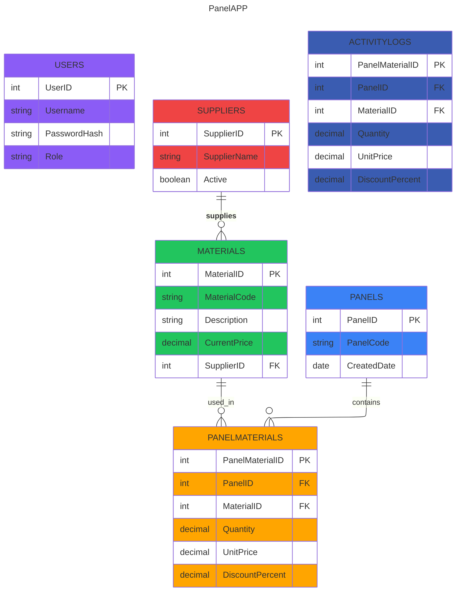
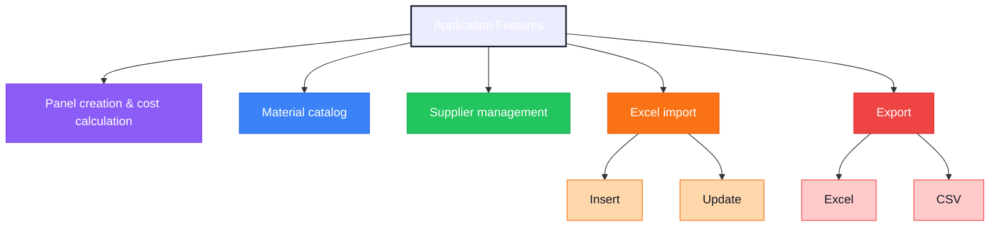
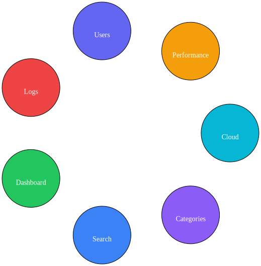

# ⚡ ZL PanelApp


> Internal ERP-style platform for managing electrical distribution panel production, material pricing, supplier relationships and project costing.

---

# 📑 Table of Contents

* [General Information](#-general-information)
* [Current Capabilities](#-current-capabilities)
* [Technologies](#-technologies)
* [Architecture](#-architecture)
* [Database](#-database)
* [Folder Structure](#-folder-structure)
* [UI Preview](#-ui-preview)
* [Development Setup](#-development-setup)
* [Database Setup](#-database-setup)
* [Authentication & Roles](#-authentication--roles)
* [Features](#-features)
* [Excel Import](#-excel-import)
* [Activity Logging](#-activity-logging)
* [User Experience](#-user-experience)
* [Deployment](#-deployment)
* [VM Setup](#-vm-setup)
* [CI/CD](#-cicd)
* [Future Improvements](#-future-improvements)
* [Acknowledgements](#-acknowledgements)
* [Version](#-version)

---

# 📌 General Information

**ZL PanelApp** is an ASP.NET Core MVC application designed for managing materials used in low-voltage electrical distribution panels.

The platform focuses on:

* material management
* supplier & customer organization
* panel cost calculation
* Excel-based bulk imports
* production workflow support
* pricing consistency
* internal operational tracking

The application is designed for real-world production usage within industrial electrical panel environments.

---

# 🚀 Current Capabilities

✅ Panel cost calculation  
✅ Snapshot pricing per panel  
✅ Material catalog management  
✅ Supplier & contact management  
✅ Customer management  
✅ Bulk Excel imports  
✅ Activity logging system  
✅ Role-based authentication  
✅ Dark / Light mode UI  
✅ Automatic theme switching  
✅ Duplicate prevention  
✅ Transaction-safe imports  
✅ Optimized large-file processing  
✅ Responsive Bootstrap interface  
✅ Real production material catalog support  

---

# 🧱 Technologies

* ASP.NET Core MVC (.NET 8)
* Entity Framework Core
* SQL Server / SQL Express
* Bootstrap 5
* ClosedXML
* Session-based Authentication
* Bootstrap Icons
* LINQ / EF Core Query Optimization

---

# 🏗️ Architecture

```text
[ Browser ]
     |
     v
[ MVC Controllers ]
     |
     v
[ Business Logic ]
     |
     v
[ Entity Framework Core ]
     |
     v
[ SQL Server ]
```
----

# 🗃️ Database (ER Diagram)

```text
Users
-----
UserID (PK)
Username
PasswordHash
Role

Suppliers
---------
SupplierID (PK)
SupplierName
Active

Materials
---------
MaterialID (PK)
MaterialCode
Description
CurrentPrice
SupplierID (FK)

Panels
------
PanelID (PK)
PanelCode
CreatedDate

PanelMaterials
--------------
PanelMaterialID (PK)
PanelID (FK)
MaterialID (FK)
Quantity
UnitPrice
DiscountPercent

Activity logs
--------------
```
----

## Relationships
```
* Supplier → Materials (1:N)
* Supplier → ContactPersons (1:N)
* Panel → PanelMaterials (1:N)
* Material → PanelMaterials (1:N)
* Customer → Panels (1:N)
* User → ActivityLogs (1:N)
```
👉 The system preserves pricing snapshots per panel line.




----


# 📁 Folder Structure


Detailed:
```text
ZL_panelapp/
│
├── Controllers/
│   ├── PanelsController.cs
│   ├── MaterialsController.cs
│   ├── HomeController.cs
│   ├── SuppliersController.cs
│   ├── ActivityLogsController.cs
│   ├── MaterialsController.cs
│   └── AccountController.cs
│
├── Models/
│   ├── Panel.cs
│   ├── Material.cs
│   ├── Supplier.cs
│   ├── ActivityLog.cs
│   ├── Customer.cs
│   ├── PanelMaterial.cs
│   ├── SupplierContactPerson.cs
│   └── User.cs
│
├── Views/
│   ├── Panels/
│   ├── Materials/
│   ├── Suppliers/
│   ├── Home/
│   ├── ActivityLogs/
│   ├── Customers/
│   ├── Account/
│   └── Shared/
│       ├── _Layout.cshtml
│       └── _AuthLayout.cshtml
│
├── Data/
│   └── ApplicationDbContext.cs
│
├── ViewModels/
│   ├── AddMaterialToPanelViewModel.cs
│   ├── CopyPanelViewModel.cs
│   ├── CustomerIndexViewModel.cs
│   ├── EditPanelMaterialAdminViewModel.cs/
│	'
│	'
│	'
│   └── SupplierIndexViewModel.cs
│
└── wwwroot/
    └── css / js / images
```


----

# 🖼️ UI Preview

👉 Replace with real screenshots for production

## Login


## Dashboard


## Materials


## Panels


----


# 🛠️ Development Setup Guide

## Prerequisites

* Visual Studio 2022+
* .NET SDK 8
* SQL Server / SQL Express
* Git

### Verify

```bash
dotnet --version
sqlcmd -?
```

----

## Clone


```bash
git clone <repo>
cd panelapp
```

----

## Run

```bash
dotnet run
```

----

# 🗄️ Database Setup

For the purpose of our implementation we developed our database in [SQL Server 2022](https://www.microsoft.com/en-us/sql-server/sql-server-downloads)
## Install SQL Express

### On windows

Steps:

1. Download:
SQL Server (Express or Developer)
SSMS (management tool)
2. Run the installer → select:
    - Basic (quick)
    - Custom (recommended)
3. In the setup:

    Instance:
   - MSSQLSERVER (default)
   - Authentication:
  -- Windows + SQL Server (Mixed Mode)

    Set a password for sa

4. Install:
5. Open SSMS and connect:
```
 Server: localhost
 Auth: Windows Authentication
```
----

### Powershell
```
// Installer
Invoke-WebRequest -Uri https://go.microsoft.com/fwlink/?linkid=866662 -OutFile SQLServer.exe

// Silent install
Start-Process -Wait -FilePath .\SQLServer.exe -ArgumentList "/Q /ACTION=Install /FEATURES=SQLEngine /INSTANCENAME=MSSQLSERVER /SECURITYMODE=SQL /SAPWD=YourStrong!Pass123 /IACCEPTSQLSERVERLICENSETERMS"

// Open port
New-NetFirewallRule -DisplayName "SQL Server" -Direction Inbound -Protocol TCP -LocalPort 1433 -Action Allow

// Check service
Get-Service -Name MSSQLSERVER

```
----

### On Linux

Steps:

```
// Add Microsoft repo
$ curl https://packages.microsoft.com/keys/microsoft.asc | sudo apt-key add -
 sudo add-apt-repository "$(curl https://packages.microsoft.com/config/ubuntu/22.04/mssql-server-2022.list)"

// Update
$ sudo apt update
$ sudo apt install -y mssql-server

// Setup
$ sudo /opt/mssql/bin/mssql-conf setup

// Start service
$ sudo systemctl status mssql-server

// Connect
$ sqlcmd -S localhost -U sa -P 'YourPassword'
```

For version, select 
- Edition (Developer = free)
- Password for _sa_

----

## Create DB

```sql
CREATE DATABASE paneldb;
```

----


## Connection String
For named sql server: `SQLEXPRESS` and database: `paneldb`

```json
"ConnectionStrings": {
  "DefaultConnection": "Server=YourServer\\SQLEXPRESS;Database=paneldb;Trusted_Connection=True;TrustServerCertificate=True;"
}
```

----

## Seed
Edw tha valw kapoio script pou kanw add user h kati tetoio
* Create Admin user
* Create Supplier

----


# 🔐 Authentication & Roles

**Admin**


*full access
*Excel imports
*supplier management
*customer management
*activity log access
*panel editing

**User**

* panel management
* materials browsing
* limited activity visibility

----

# ✅ Run & Verification

* Open: http://localhost:5100
* Login works
* Materials load
* Panels load
* Suppliers load
* Customers load
* Import works

----


# 📦 Features



----

# 💻 Code Highlights

## Import Logic

```csharp
if (existing == null)
{
    _context.Materials.Add(new Material { ... });
}
else
{
    existing.CurrentPrice = price;
}
```

----

## Transaction Safety

```csharp
await transaction.CommitAsync();
```

## HTTPS

```csharp
await transaction.CommitAsync();
```


----

# 🧠 Data Integrity & Safety

* Unique: `(SupplierID + MaterialCode)`
* Duplicate prevention
* Transaction-safe imports
* Controlled updates

----

# 📊 Excel Import

Mandatory supplier selection from UI.

Format:

```text
MaterialCode | Description | Price | Unit
```

Rules:

* One supplier per file
* No duplicates
* Update existing

----

# 🚀 Deployment Guide

## Publish

Visual Studio → Publish → Folder

```text
bin/Release/net8.0/publish/
```

---

## Deploy

```text
C:\Deploy\ZLPanelApp
```

----

## Run

```bash
dotnet ZL_panelapp.dll

or

Run C:\Deploy\ZLPanelApp\ZLPanelApp.exe

```

----

## IIS 
Validity IIS using browser

### Windows GUI

1. Enable → Control Panel → Programs → Turn Windows features on or off

2. 
- ✅Web Management Tools
- ✅Internet Information Services
- ✅World Wide Web Services 
   - Application Development Features
		- ✔️ .NET Extensibility
		- ✔️ ASP.NET
		- ✔️ ISAPI Extensions
3. ΟΚ → Install

	```- C:\inetpub```


----

### PowerShell
1. IIS Enable

```Enable-WindowsOptionalFeature -Online -FeatureName IIS-WebServerRole -All```

2. For ASP.NET:

`Enable-WindowsOptionalFeature -Online -FeatureName IIS-ASPNET45`

----

### config
1. IIS Manager (inetmgr)

* Sites → Add Website
	- Site name: MyApp
	- Physical path: `C:\inetpub\myapp`
	- Binding:
		- Type: http
		- IP: 192.168.200.200
		- Port: 8080
		
2. IIS → Application Pools
* Name: panelapp
* .NET CLR: v8.0
* Managed pipeline: No managed code

3. Firewall
```
New-NetFirewallRule -zlpanelapprule "HTTP" -Direction Inbound -Protocol TCP -LocalPort 8080 -Action Allow
```

4. **PERMISSION RULES**

5. Verify port listen

```bash
ipconfig
netstat -ano | findstr :8080
```
6. Local Network access
```
http://192.168.200.200
```


----

# 🖥️ VM Setup
Assuming that the application is developed within the VM
* Hosting Bundle
* IIS

Minimum
* Windows 8 VM 80+ GB
* 4GB RAM+
* SQL Express 2018


Recommended
* Windows 11 VM 150GB+
* 8GB RAM+
* SQL Express 2022


---

# ⚙️ CI/CD Pipeline

```text
Git Push → Build → Publish → Deploy
```

```bash
dotnet build
dotnet publish -c Release -o C:\Deploy\ZLPanelApp
```

---

# 🔮 Future Improvements

* Material categories
* Dashboard analytics
* Logging system
* Performance optimization
* Cloud deployment

* 📂 Categories για materials (ABB / Schneider / etc)
* 🔍 Advanced search & filters
* 📊 Dashboard metrics (costs, totals)
* 🧾 Audit logs
* 👥 Full user management UI
* ⚡ Bulk import performance optimization
* ☁️ Cloud deployment (Azure / AWS)




----

# 🙏 Acknowledgements

Developed for recording electrical distribution panel equipment for the company **Company**.

----

# 📌 Version

v0.1 – Development


```
TO BE CONTINUED
```